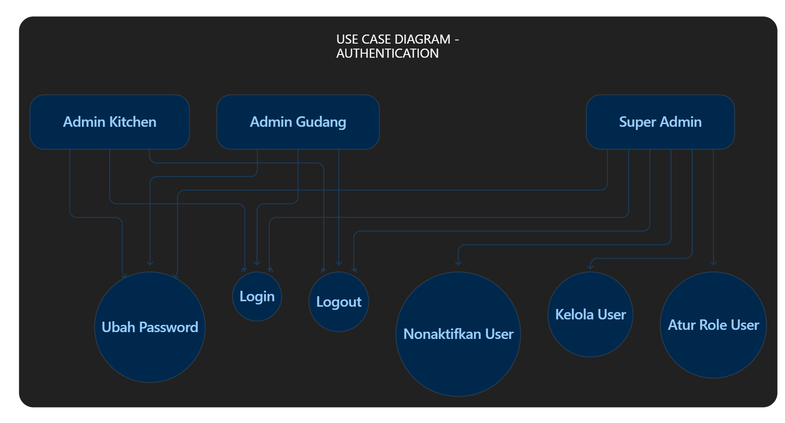
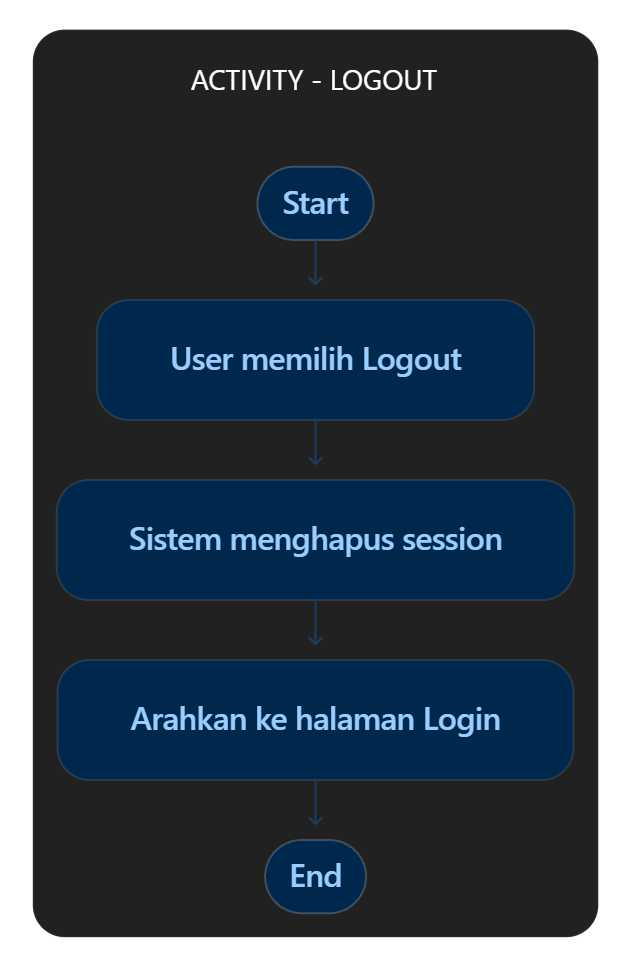
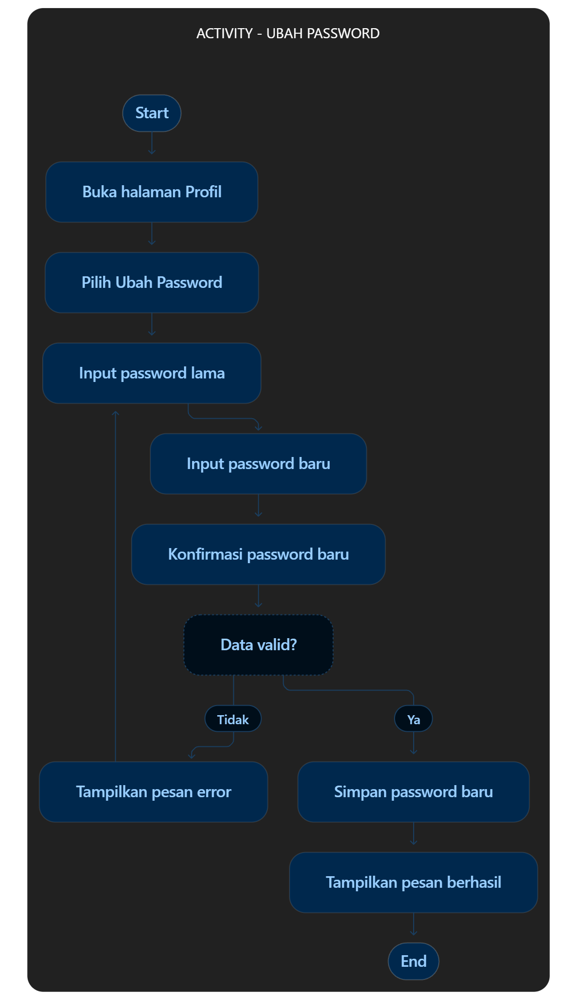
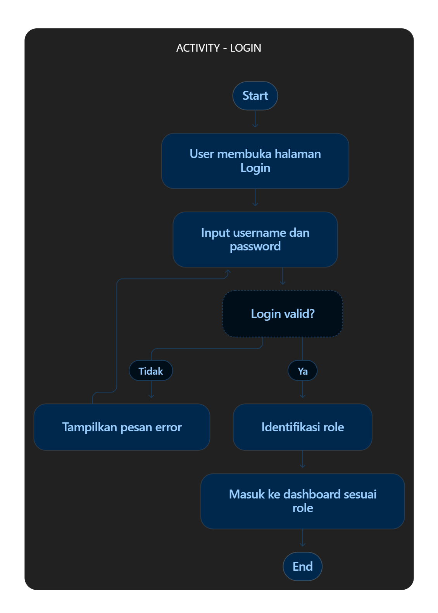
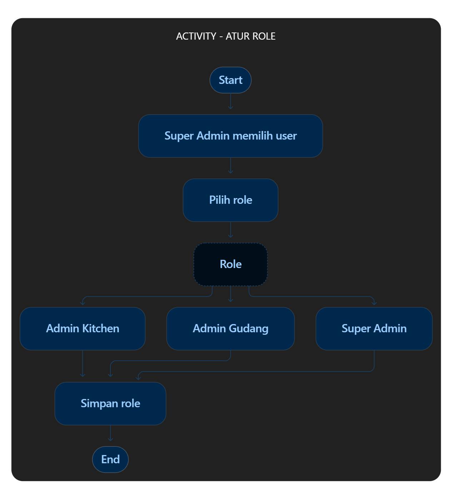
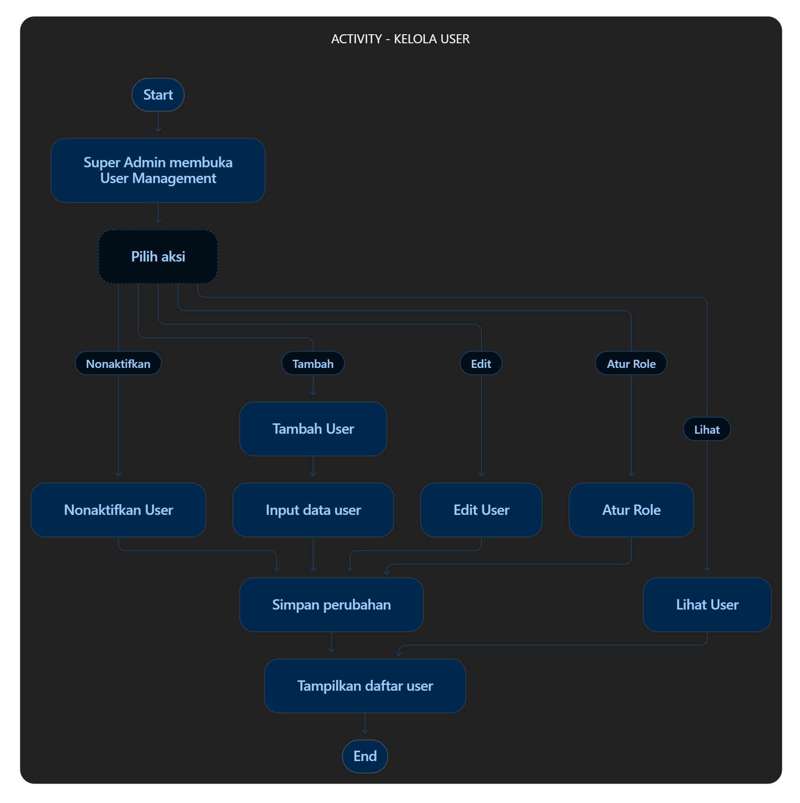
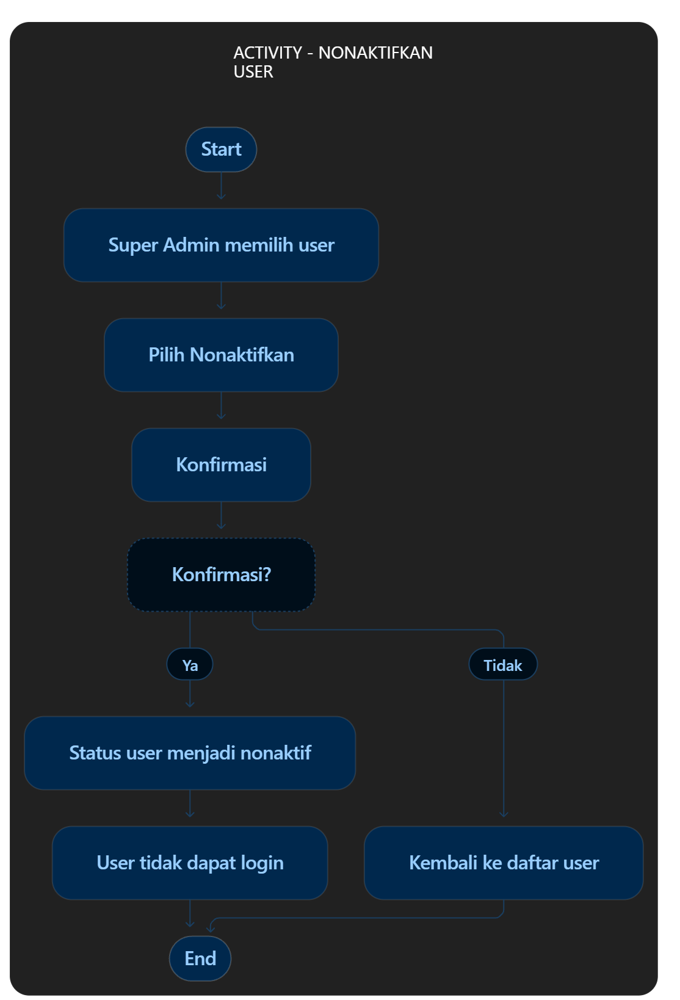
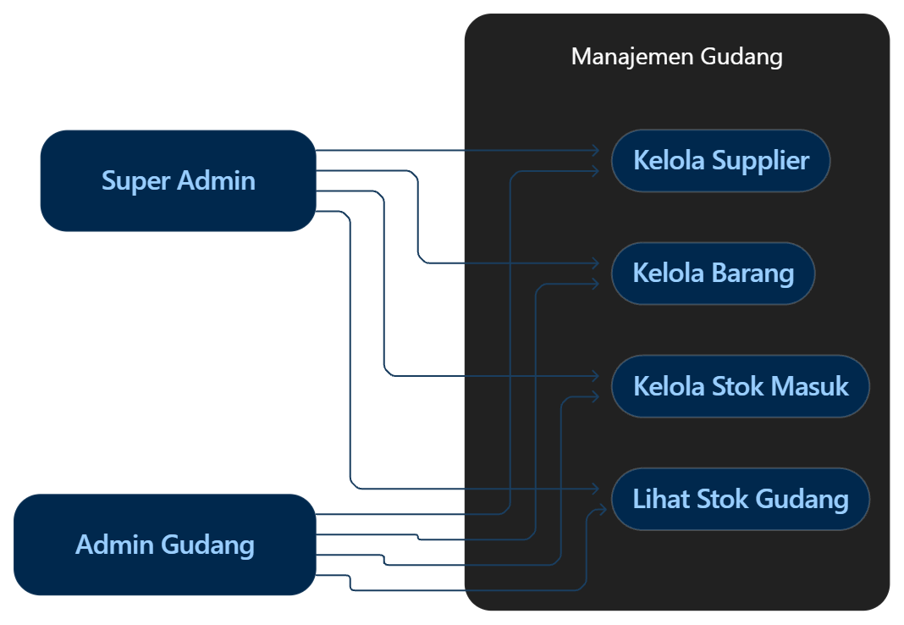
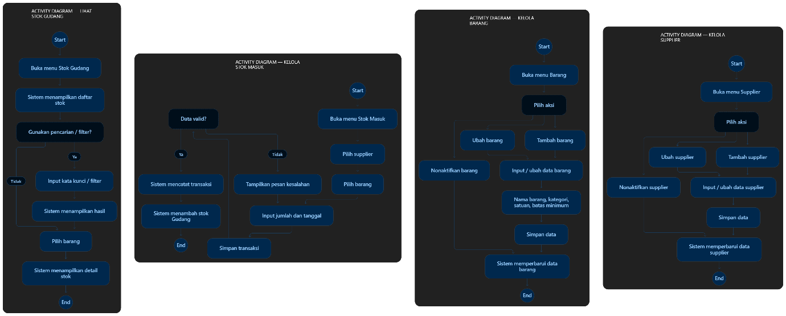

# Dapursari IMS — Spesifikasi Modul

Dokumen requirement untuk Inventory Management System Dapursari.
Sumber: modul proyek (functional requirements + diagram).

Diagram disimpan di `docs/assets/modul-proyek/`.

---

## Modul 1 — Authentication

### Functional requirements

| ID | Requirement |
| --- | --- |
| FR-AUTH-01 | Sistem dapat melakukan login |
| FR-AUTH-02 | Sistem dapat melakukan logout |
| FR-AUTH-03 | Sistem dapat mengubah password |
| FR-AUTH-04 | Sistem dapat mengelola data user |
| FR-AUTH-05 | Sistem dapat menentukan role user |
| FR-AUTH-06 | Sistem dapat mengaktifkan dan menonaktifkan user |
| FR-AUTH-07 | Sistem dapat membatasi akses berdasarkan role |

### Roles

| Role | Akses |
| --- | --- |
| Super Admin | Seluruh akses |
| Admin Gudang | Fitur gudang |
| Admin Stok/Kitchen | Fitur kitchen |

### Use case diagram — Authentication

Semua role dapat **Login**, **Logout**, dan **Ubah Password**.  
Hanya **Super Admin** yang dapat **Kelola User**, **Atur Role User**, dan **Nonaktifkan User**.

### Activity — Logout

### Activity — Ubah Password

### Activity — Login

### Activity — Atur Role

### Activity — Kelola User

### Activity — Nonaktifkan User

---

## Modul 2 — Manajemen Gudang

### Functional requirements

| ID | Requirement |
| --- | --- |
| FR-GDG-01 | Sistem dapat mengelola data supplier |
| FR-GDG-02 | Sistem dapat mengelola data barang beserta kategori, satuan, dan batas minimum stok |
| FR-GDG-03 | Sistem dapat mengelola transaksi stok masuk |
| FR-GDG-04 | Sistem dapat melihat stok gudang |

### Use cases & akses

| ID | Use case | Super Admin | Admin Gudang |
| --- | --- | --- | --- |
| UC-GDG-01 | Kelola Supplier | ✓ | ✓ |
| UC-GDG-02 | Kelola Barang | ✓ | ✓ |
| UC-GDG-03 | Kelola Stok Masuk | ✓ | ✓ |
| UC-GDG-04 | Lihat Stok Gudang | ✓ | ✓ |

### Use case diagram — Manajemen Gudang

### Activity diagrams — Manajemen Gudang

Diagram gabungan untuk:

- Lihat Stok Gudang
- Kelola Stok Masuk
- Kelola Barang
- Kelola Supplier

---

## Modul 3 — Permintaan & Transfer Stok Kitchen

> Detail functional requirement dan diagram belum tersedia di sumber. Placeholder untuk pengembangan berikutnya.

---

## Modul 4 — Manajemen Stok Kitchen

> Detail functional requirement dan diagram belum tersedia di sumber. Placeholder untuk pengembangan berikutnya.

---

## Modul 5 — Stok Opname

> Detail functional requirement dan diagram belum tersedia di sumber. Placeholder untuk pengembangan berikutnya.

---

## Modul 6 — Riwayat Stok

> Detail functional requirement dan diagram belum tersedia di sumber. Placeholder untuk pengembangan berikutnya.

---

## Modul 7 — Log Aktivitas

> Detail functional requirement dan diagram belum tersedia di sumber. Placeholder untuk pengembangan berikutnya.

---

## Modul 8 — Dashboard

> Detail functional requirement dan diagram belum tersedia di sumber. Placeholder untuk pengembangan berikutnya.
